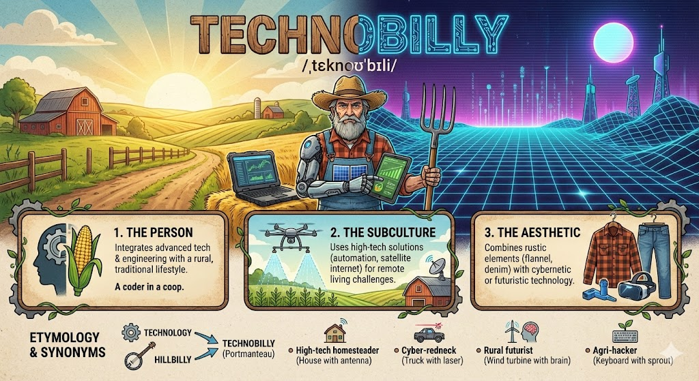

## Welcome

This is a blog about my personal technology projects. These projects are typically solutions to problems or annoyances I have encountered in my life.

---

### Technobilly
*/ˌtɛknoʊˈbɪli/*
**noun** (informal)

1.  A person who integrates advanced technology, computer science, or engineering expertise with a rural, agrarian, or traditional "hillbilly" lifestyle.
2.  A subculture characterized by the use of high-tech solutions (such as automation, satellite internet, or 3D printing) to solve problems inherent to remote or homestead living.
3.  An aesthetic combining rustic elements (flannel, denim, agricultural equipment) with cybernetic or futuristic technology.

---

**Etymology**
A **portmanteau** of *technology* (or *technologist*) and *hillbilly*.

**Usage Examples**
> "He is a true **technobilly**; he writes code for a Silicon Valley firm by day, but uses a Raspberry Pi to automate his chicken coop door by night."

> "The **technobilly** approach to farming involves less manual labor and more drone surveillance."

**Synonyms**
* High-tech homesteader
* Cyber-redneck
* Rural futurist
* Agri-hacker